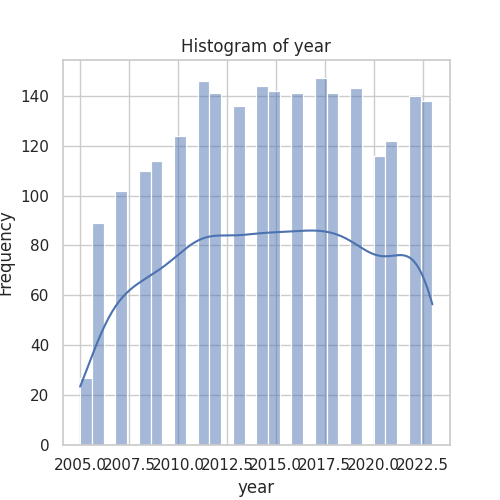
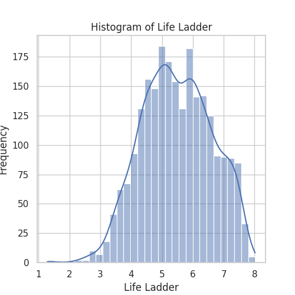
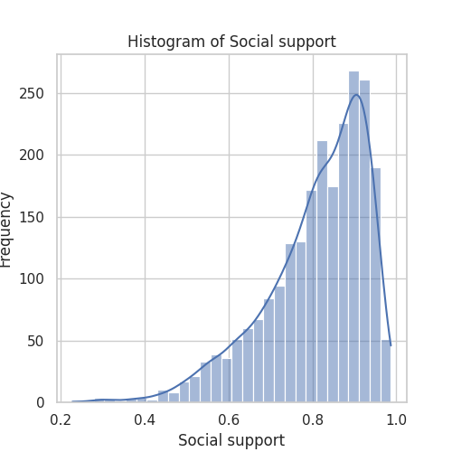
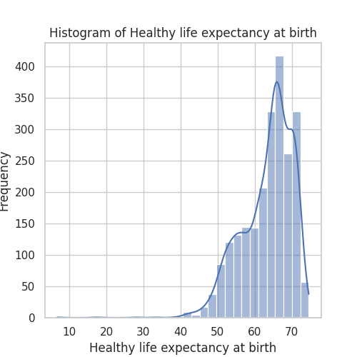
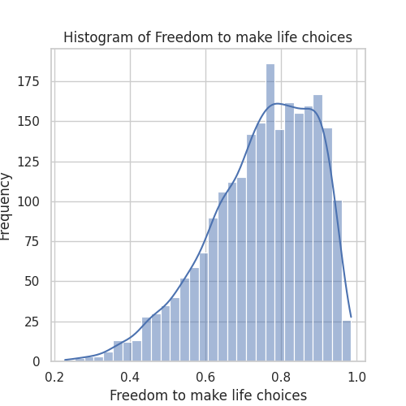
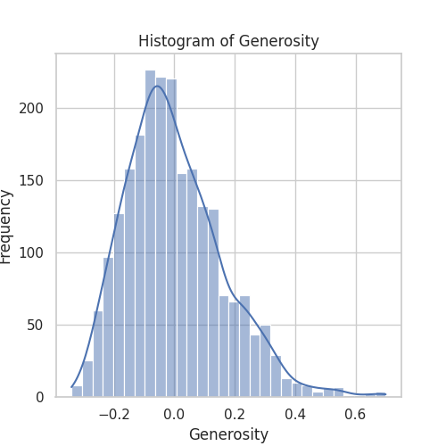
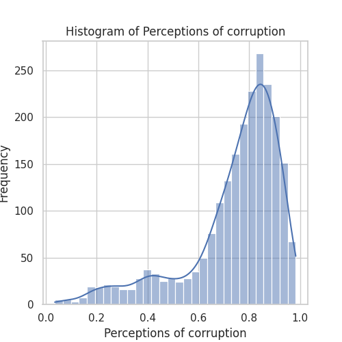
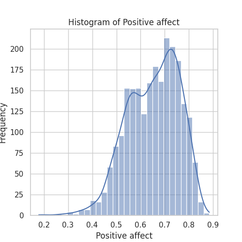
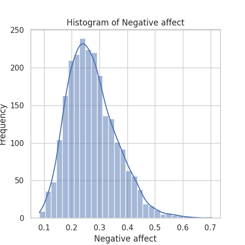

# Happiness Dataset Analysis
This dataset contains information related to happiness across various countries from 2005 to 2023.

## Summary of the Analysis
The main focus of the analysis is on numerical attributes related to happiness and their correlations with economic and social factors.

### Histograms
- Histogram for year: 
- Histogram for Life Ladder: 
- Histogram for Log GDP per capita: 
- Histogram for Social support: 
- Histogram for Healthy life expectancy at birth: 
- Histogram for Freedom to make life choices: 
- Histogram for Generosity: 
- Histogram for Perceptions of corruption: 
- Histogram for Positive affect: 
- Histogram for Negative affect: 

### Correlation Analysis
The correlation heatmap illustrates the relationships between various factors. Notably, the 'Log GDP per capita' and 'Life Ladder' show a strong positive correlation (0.78), indicating that higher GDP is associated with higher happiness levels.
Additionally, 'Social support' and 'Life Ladder' also display a strong correlation (0.72). This suggests that social connectedness plays a significant role in overall happiness.
Conversely, variables like 'Generosity' and 'Negative affect' exhibit weaker or negative correlations with happiness measures.
